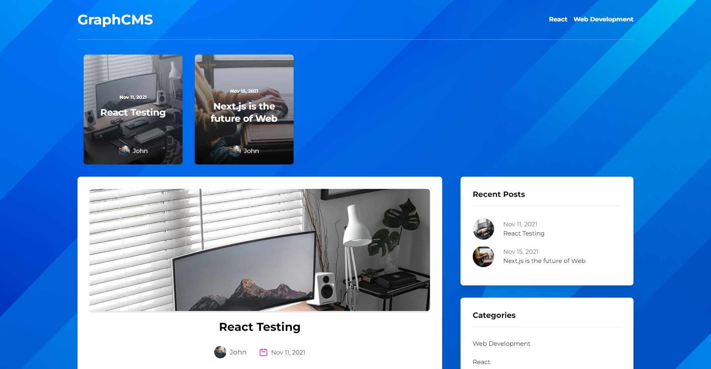
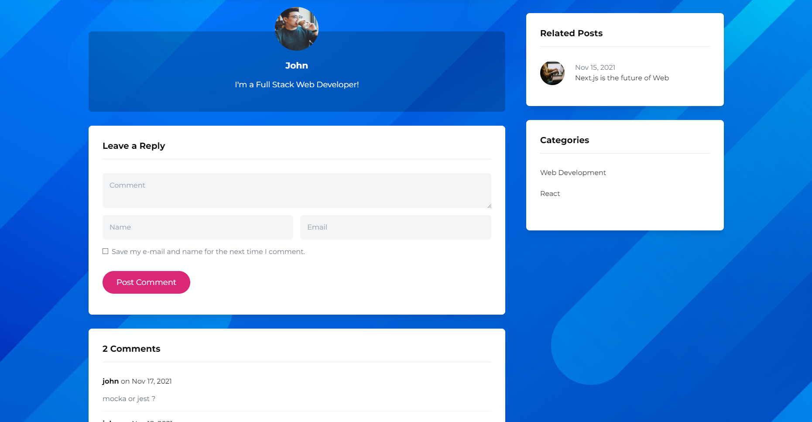

<h1 align="center">CMS_BLOG</h1>

<div align="center">

[](https://cms-blog-rose.vercel.app)
[]()
[](https://cms-blog-rose.vercel.app)

</div>

<p align="center"> A fully functional Blog application using GraphQL.
    <br> 
</p>

## [Live link](https://cms-blog-rose.vercel.app "Live link")

## 📷 Screenshots <a name = "ScreenShots"></a>

<br>





## ⛓️ Dependencies <a name = "dependencies"></a>

<br>

- "graphql": "^16.0.1",
- "graphql-request": "^3.6.1",
- "html-react-parser": "^1.4.0",
- "moment": "^2.29.1",
- "next": "latest",
- "react": "^17.0.2",
- "react-dom": "^17.0.2",
- "react-multi-carousel": "^2.6.5",
- "sass": "^1.43.4"
- "autoprefixer": "^10.2.6",
- "postcss": "^8.3.5",
- "tailwindcss": "^2.2.4"

<br>

## 🏁 Getting Started <a name = "getting_started"></a>

These instructions will get you a copy of the project up and running on your local machine for development
and testing purposes. See [deployment](#deployment) for notes on how to deploy the project on a live system.

### Installing

```
npm install
```

## 🎈 Usage <a name="usage"></a>

```
npm run dev
```

## ⛏️ Built With <a name = "tech_stack"></a>

- [Next.js](https://nextjs.org) - Front-end JavaScript library
- [Tailwind CSS](https://tailwindcss.com) - Css Framework
- [GraphCMS](https://graphcms.com) - Back-end

## ✍️ Authors <a name = "authors"></a>

- [Youssef Sahli](https://github.com/Myduzo)
